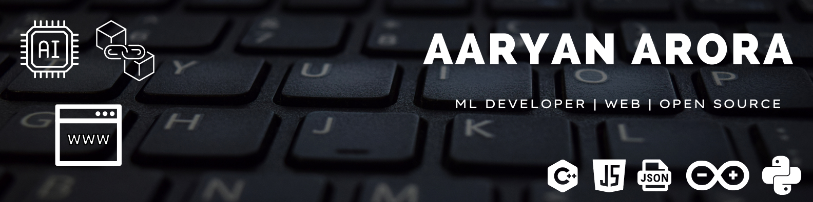

  
- 👋 Hi, I’m Aaryan Arora
- 👀 I’m interested in programming
- 🌱 I’m currently learning C++, Blockchain and web development
- 🔎 Exploring Machine Learning
- 📝 Check out my [portfolio](https://aaryan2134.me/)
  

## GitHub Stats

🔨 GitHub Contributions

 

💻 GitHub Profile Stats

## Languages and Tools:  

<code></code>
<code></code>
<code></code>
<code></code>
<code></code> 

## Feel free to reach out on: 

 

<!---
aaryan2134/aaryan2134 is a ✨ special ✨ repository because its `README.md` (this file) appears on your GitHub profile.
You can click the Preview link to take a look at your changes.
--->
