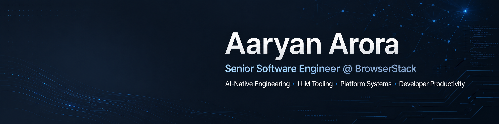

  

<h1 align="center">Hi, I'm Aaryan Arora 👋</h1>

  <b>Senior Software Engineer @ BrowserStack</b> 
  AI-Native Engineering · Backend & Platform Systems · LLM Tooling · Developer Productivity · Distributed Systems

  <a href="https://www.linkedin.com/in/aaryan2134/">LinkedIn</a> ·
  <a href="https://github.com/Baaryan">Official GitHub</a> ·
  <a href="https://github.com/aaryan2134">Personal GitHub</a> ·
  <a href="mailto:aaryan2134@gmail.com">Email</a> ·
  <a href="https://top.mlh.io/2023/profiles/aaryan-arora">MLH Top 50</a>

---

## About Me

I'm a Senior Software Engineer at **BrowserStack**, working on backend and platform systems for large-scale test automation infrastructure.

My work spans distributed orchestration, reliability, observability, compliance, API design, automation workflows, and engineering productivity. I’m especially interested in **AI-native software development** — using LLMs, internal tools, and workflow automation to help engineers ship faster, debug better, reduce repetitive work, and build smarter systems.

Previously, I interned at **Expedia Group**, where I worked on backend services using Java Spring Boot and React. I graduated from **Delhi Technological University** in Computer Engineering and was named one of **Major League Hacking’s Top 50 Hackers of 2023**.

---

## Current Focus

- Building reliable backend and platform systems for large-scale automation infrastructure
- Exploring AI-native engineering workflows using LLMs, agents, MCPs, and internal tooling
- Improving developer productivity through automation, tooling, and better engineering workflows
- Working with distributed systems, Redis/Kafka-backed workflows, observability, and production reliability
- Learning more about AI-assisted development, devtools, platform engineering, and system design

---

## Tech Stack

### Backend & Platform

Ruby on Rails · Java · Spring Boot · Node.js · Python · REST APIs · WebSockets

### Distributed Systems & Infra

Kafka · Redis · Elasticsearch · BigQuery · AWS · Kubernetes · Terraform · CI/CD

### AI-Native Engineering

LLMs · AI-assisted development · Prompt engineering · MCPs · Internal tools · Developer productivity workflows

### Automation & Testing

Selenium · Appium · Playwright · Cypress · Puppeteer

---

## Selected Work & Impact

- Led development of **AI Mobile Self-Healing** for mobile automation, scaling usage to **24,000+ sessions** with **38.8% month-over-month growth**
- Improved platform reliability by designing a modular Hub/Rails pipeline, reducing production downtime by **30%**
- Built browser profiling support for process-level CPU and memory visibility
- Worked on compliance-focused geo-region restriction systems for customer PII and test session logs
- Delivered enterprise-enabling automation capabilities across Playwright, Safari, and BrowserStack Automate
- Built and promoted AI/LLM-assisted workflows to improve engineering productivity across debugging, PR reviews, RCA, alert analysis, and repetitive development tasks

---

## Featured Projects

### AI / ML / GenAI

- [ProctorLy](https://github.com/aaryan2134/proctorLy) — AI-based proctorless examination system
- [Aariaabhi](https://github.com/aaryan2134/Aariaabhi) — GenAI-powered sustainable commerce platform
- [Video Popularity Prediction](https://github.com/aaryan2134/Video-Popularity-Prediction) — ML model for predicting video views using metadata

### Full Stack / Product Builds

- [News Dribble](https://github.com/aaryan2134/News-Dribble) — NBA news, standings, upcoming games, NFTs, and fan engagement
- [Green Commerce](https://github.com/aaryan2134/Aariaabhi) — Sustainable product scoring and recommendation system
- [GreenCharge Mobilothon](https://github.com/aaryan2134/GreenCharge_Mobilothon) — Django, blockchain, and ML-based sustainability project

### Open Source

- [Health Expense Planner](https://github.com/aaryan2134/Health-Expense-Planner)
- [Interview Scheduler](https://github.com/aaryan2134/Interview-Scheduler)
- [OMDb API Connector - Microsoft Power Platform](https://github.com/microsoft/PowerPlatformConnectors/tree/dev/independent-publisher-connectors/OMDb%20API)
- [ORB Intelligence Connector - Microsoft Power Platform](https://github.com/microsoft/PowerPlatformConnectors/tree/dev/independent-publisher-connectors/ORB%20Intelligence)
- [Power Apps Sample Contribution](https://github.com/pnp/powerapps-samples/pull/173)

---

## Hackathons & Recognition

- **MLH Top 50 Hacker of 2023**
- **Flipkart Grid 5.0 National Finalist**
- **HackWithInfy 2022 Finalist**
- **Gold Microsoft Learn Student Ambassador**
- **Stibo Systems India Hackathon Winner**

---

## Content & Talks

- [Integrating Power Apps with Azure Machine Learning & OpenAI](https://techcommunity.microsoft.com/t5/educator-developer-blog/integrating-power-apps-with-azure-machine-learning-amp-open-ai/ba-p/3835949)
- [Microsoft Reactor Session](https://www.youtube.com/watch?v=hFF_5CvXRig&list=PLmsFUfdnGr3yQmiO3tE4CnDEeyo5bs61S&index=8&ab_channel=MicrosoftReactor)
- [Microsoft 365 & Power Platform Community Talk](https://www.youtube.com/watch?v=A2evuHKlFxM&ab_channel=Microsoft365%26PowerPlatformCommunity)

---

## GitHub Stats

  
GitHub Contributions

   
  

 

  
GitHub Profile Stats

   

  | GitHub Stats | Languages |
  | --- | --- |
  |  |  |

---

  Building reliable systems, AI-native workflows, and tools that help engineers move faster.

